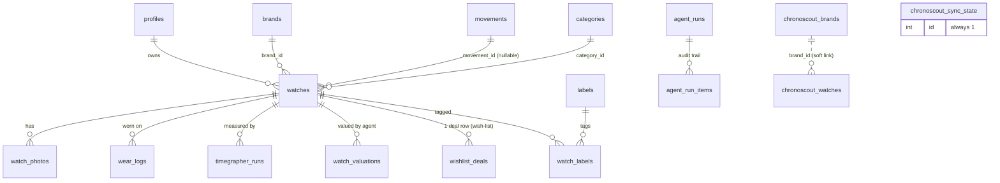

# CaliberShelf Data Model

The database is Postgres (hosted Supabase). Migrations in `supabase/migrations/`
are the source of truth; this doc is the map. Money is stored as integer
**BIGINT cents** everywhere except agent-run costs, which use integer
**microdollars** (`cost_usd_micros`, usd × 1,000,000) because per-item agent
costs are fractions of a cent.

## Ownership models

Three RLS patterns are in play — know which one a table uses before querying or
writing it:

- **Owner-scoped** (most tables): `user_id` column, RLS `auth.uid() = user_id`.
  The default for anything that is a user's personal data.
- **Global reference** (`movements` is per-user now; the ChronoScout mirror is
  the live example): no `user_id`; RLS grants read to any authenticated user;
  writes only via the service role (the sync script). Shared catalog data.
- **Operational / mixed** (`agent_runs`, `agent_run_items`): nullable `user_id`;
  RLS shows the owner their own rows plus system (null-user) rows. Cron agents
  log as "system"; the interactive spec-fetch logs owner rows.

## Entity relationships

Dashed / detached tables (`chronoscout_*`) are the global ChronoScout catalog
mirror — they are **not** foreign-keyed to the user's `brands`/`watches`; the
"Find in catalog" picker matches them by text and copies dimensions across.

## Table catalog

| Table | Ownership | Written by | Purpose / key columns |
|---|---|---|---|
| `profiles` | owner | app (auth) | user profile; `is_public` for future sharing; `tier_config` JSONB (00030) holds the user's price-tier labels and bounds; `box_config` JSONB (00032) holds `{ count }` for the numbered storage boxes |
| `brands` | owner | app + `find-store-urls` | `name`, `brand_type`, `store_url` (feeds deal-check), `logo_url` |
| `movements` | owner | app | caliber catalog; `caliber_name`, `caliber_type`, `beat_rate`, `lift_angle` |
| `categories` | owner | app | display grouping (renamed from display_cases); `name`, `color` |
| `labels` | owner | app | free tags; `name`, `color` |
| `watch_labels` | via watch | app | junction watch↔label (composite PK) |
| `watches` | owner | app + `find-references` (ref) | the core record; specs, `rotating_bezel` (00029), `box` (00031, free-text storage location), `is_wishlist`, `is_coming_soon`, `price_check_enabled`, `reference_unverified` |
| `watch_photos` | owner | app | storage paths + `is_cover`, `thumb_path` |
| `wear_logs` | owner | app | one row per wear-day; `worn_date` |
| `timegrapher_runs` | owner | app | accuracy measurements; rate/amplitude/beat error |
| `watch_valuations` | owner | `price-check` | time series of market-value estimates; `value_mid_cents`, `confidence`, `datapoints`, `sources`, `agent_model` |
| `wishlist_deals` | owner | `deal-check` | one current row per wish-list watch; `availability`, `retail_price_cents`; `best_used_*` reserved for Phase B |
| `chronoscout_brands` | global | `chronoscout-sync` | mirrored catalog brands; `domain`, `price_min/max_cents`, specs |
| `chronoscout_watches` | global | `chronoscout-sync` | mirrored catalog models; dimensions; trigram-indexed `name` |
| `chronoscout_sync_state` | global | `chronoscout-sync` | single row; last sync times, counts, `license` |
| `agent_runs` | operational | all agents via `scripts/lib/agent-run.mjs` (+ spec-fetch route) | one row per agent invocation; duration, cost (micros), item counts, tokens |
| `agent_run_items` | operational | agents (audit trail) | per-entity detail for a run; `action`, `field`, `detail`, `confidence`, `sources` |

## The three classification axes

Deliberately kept separate — a watch's style, its mechanics, and its price are
independent facts, and collapsing them produces a taxonomy that can't answer
useful questions.

- **Category** — the design archetype, exactly one per watch. These are *rows*
  in the user-managed `categories` table, not an enum, so they can be renamed
  and re-bucketed without a migration. Currently Dress, Sport, Chronograph,
  Daily (pilot/field/GADA collapsed), and Horology (a watchmaking showpiece —
  intent, not price).
- **Complications** — what the movement actually does, zero or more per watch,
  stored comma-joined in `watches.complication` and offered from
  `KNOWN_COMPLICATIONS` in `src/lib/validations/watch.ts`: Date, Day, DTZ,
  Power Reserve, Annual Calendar, Perpetual Calendar, Moon Phase, and Fancy
  (the catch-all for anything exotic, e.g. a tourbillon). These are the ONLY
  complications that can be set — there is no free-text entry. A finishing style
  such as skeletonization is not a complication; neither is a design genre such
  as Chronograph, which earns its place as a category.
- **Tier** — the price segment, never stored on the watch. It is derived from
  `purchase_price_cents` against the user's own bands in `profiles.tier_config`
  (an ordered JSONB array of `{label, max}`, `max` exclusive, last row `null`
  for the open top). `src/lib/tiers.ts` holds the pure conversion helpers and
  the defaults; `Config → Tiers` edits them; reports resolve bands at request
  time so renaming a tier reflows every chart immediately.

## Which agent writes what

See [agents.md](agents.md) for the full fleet. In short: `price-check` →
`watch_valuations`; `deal-check` → `wishlist_deals`; `find-references` →
`watches.reference_number`; `find-store-urls` → `brands.store_url`/`brand_type`;
`chronoscout-sync` → `chronoscout_*`; the spec-fetch route and the catalog
picker write nothing directly (they return data the form applies). **All** of
them now also append to `agent_runs` for the Agent Execution Review report.
