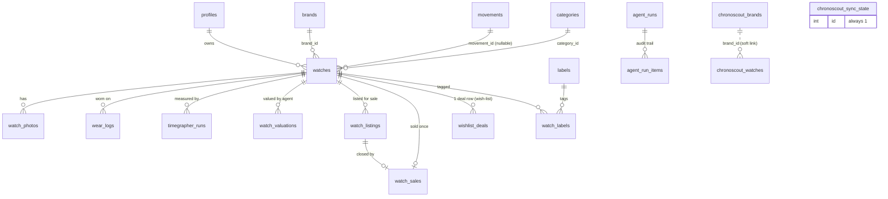

# TenTenLoupe Data Model

The database is Postgres (hosted Supabase). Migrations in `supabase/migrations/`
are the source of truth; this doc is the map. Money is stored as integer
**BIGINT cents** everywhere except agent-run costs, which use integer
**microdollars** (`cost_usd_micros`, usd × 1,000,000) because per-item agent
costs are fractions of a cent.

## Ownership models

Three RLS patterns are in play — know which one a table uses before querying or
writing it:

- **Owner-scoped** (most tables): `user_id` column, RLS `auth.uid() = user_id`.
  The default for anything that is a user's personal data.
- **Global reference** (`movements` is per-user now; the ChronoScout mirror is
  the live example): no `user_id`; RLS grants read to any authenticated user;
  writes only via the service role (the sync script). Shared catalog data.
- **Operational / mixed** (`agent_runs`, `agent_run_items`): nullable `user_id`;
  RLS shows the owner their own rows plus system (null-user) rows. Cron agents
  log as "system"; the interactive spec-fetch logs owner rows.

## Entity relationships



Dashed / detached tables (`chronoscout_*`) are the global ChronoScout catalog
mirror — they are **not** foreign-keyed to the user's `brands`/`watches`; the
"Find in catalog" picker matches them by text and copies dimensions across.

## Table catalog

| Table | Ownership | Written by | Purpose / key columns |
|---|---|---|---|
| `profiles` | owner | app (auth) | user profile; `is_public` for future sharing; `tier_config` JSONB (00030) holds the user's price-tier labels and bounds; `box_config` JSONB (00032) holds `{ count }` for the numbered storage boxes |
| `brands` | owner | app + `find-store-urls` | `name`, `brand_type`, `store_url` (feeds deal-check), `logo_url`, `is_wishlist` (00036 — wish-list brand, auto-cleared when an owned/coming-soon watch is saved for it) |
| `movements` | owner | app | caliber catalog; `caliber_name`, `caliber_type`, `beat_rate`, `lift_angle` |
| `categories` | owner | app | display grouping (renamed from display_cases); `name`, `color` |
| `labels` | owner | app | free tags; `name`, `color` |
| `watch_labels` | via watch | app | junction watch↔label (composite PK) |
| `watches` | owner | app + `find-references` (ref) | the core record; specs, `rotating_bezel` (00029), `box` (00031, free-text storage location), `is_wishlist`, `is_coming_soon`, `price_check_enabled`, `reference_unverified`; Phase 5 (00043) adds `sale_status`, `target_ask_cents`, the three `acq_*_cents` acquisition costs, and **generated** `cost_basis_cents`; 00051 adds `attachment` (max\|high\|medium\|low, nullable) and drops `candidate_since`/`candidate_note` |
| `watch_photos` | owner | app | storage paths + `is_cover`, `thumb_path` |
| `wear_logs` | owner | app | one row per wear-day; `worn_date` |
| `timegrapher_runs` | owner | app | accuracy measurements; rate/amplitude/beat error |
| `watch_valuations` | owner | `price-check` + the app | time series of market-value estimates; `value_mid_cents`, `confidence`, `datapoints`, `sources`, `agent_model`; `source` = `agent`\|`manual`\|`tier` (00046, 00053) + `entered_note`. Which one is a watch's CURRENT value is decided in `src/lib/valuation.ts`, nowhere else; `tier` rows are the static estimate for untracked watches (one per watch, no history, `run_mode='static'`) |
| `watch_listings` | owner | app | one row per time a watch goes on the market (00044); `venue` enum, `ask_price_cents`, `listed_at`, `status` (`active`\|`sold`\|`withdrawn`). Partial unique index allows at most one `active` row per watch — days-on-market and price-drop history live here |
| `watch_sales` | owner | app | the sale record (00045), `UNIQUE (watch_id)` — the linear lifecycle made physical; sale price, denormalized venue, buyer/payment/tracking, four fee columns, and **generated** `net_proceeds_cents` |
| `wishlist_deals` | owner | `deal-check` | one current row per wish-list watch; `availability`, `retail_price_cents`; `best_used_*` reserved for Phase B |
| `inspiration_images` | owner | app | Inspiration Gallery (00039): admired watch photography as a photo-lab mood board; storage under `{user_id}/inspiration/`, note ≤80 chars |
| `watch_image_scores` | owner | `photo-score` | photo-scoring agent (00040): one row per image per watch keyed by `content_hash`; CV metrics (dial-ROI sharpness/brightness/glare, phash, dup grouping), stack collapse (`stack_seq`/`stack_role`), Track A card verdicts (`shot_card`, `card_pass`), Track B rubric + hero columns; covers local capture-folder frames (nullable `watch_photo_id` links uploads later) |
| `collection_guides` | owner | app + guide seeders | Master Collection Guides (00038): name, thesis, source document, version. Seeded: "Grand Seiko" (`seed-gs-guide`, v2.0 — 15-slot Part A + 4-entry Canon with `status='passed'`, per the Aug 2026 adversarial review) and "Swiss Artisans" (`seed-swiss-guide`, JLC × Vacheron Constantin, v1.0) |
| `guide_entries` | owner | app + guide seeders | guide chapters (00038): position/chapter/title/reference, target band cents, priority, stored status (candidate\|passed), nullable `watch_id` — a linked entry's display status derives LIVE from the watch. Swiss guide uses `chapter` = maison and `notes` for stretch/negotiation labels |
| `straps` | owner | app | strap/bracelet assets (00037): `material` (validated set), `width_mm` (Phase Two fit matching vs `watches.strap_width_mm`), `quick_release`, `micro_adjust`, `source` + `source_watch_id` (OEM origin), `current_watch_id` (mounted watch, unique per watch), money columns |
| `strap_photos` | owner | app | mirrors `watch_photos`; storage path `{user_id}/straps/{strap_id}/…` in the watch-photos bucket |
| `chronoscout_brands` | global | `chronoscout-sync` | mirrored catalog brands; `domain`, `price_min/max_cents`, specs |
| `chronoscout_watches` | global | `chronoscout-sync` | mirrored catalog models; dimensions; trigram-indexed `name` |
| `chronoscout_sync_state` | global | `chronoscout-sync` | single row; last sync times, counts, `license` |
| `agent_runs` | operational | all agents via `scripts/lib/agent-run.mjs` (+ spec-fetch route) | one row per agent invocation; duration, cost (micros), item counts, tokens |
| `agent_run_items` | operational | agents (audit trail) | per-entity detail for a run; `action`, `field`, `detail`, `confidence`, `sources` |

## The sale lifecycle (Phase 5)

Linear, one status per watch, held in `watches.sale_status`:
`owned → listed → sold`. **Transitions are enforced in
`src/lib/actions/sales.ts`**, deliberately not by a DB CHECK — the app owns the
lifecycle and a constraint here would block backfills. The permitted moves are:

```
owned  → listed          (mark for sale — opens a watch_listings row)
listed → sold | owned    (owned = withdrawn, listing row closed)
sold   → owned           (undo: deletes the sale row)
```

**`candidate` was retired in 00051.** "Thinking about it" was a state the app
tracked and the owner never used: a watch is either for sale — with a venue, a
date and an ask — or it is not. The migration moved every candidate row back to
`owned` and dropped `candidate_since` / `candidate_note`. The *value* survives
in the `public.sale_status` enum, because removing an enum value means
recreating the type and rewriting every column that uses it; no row holds it
and no code path can write it. Do not reintroduce it.

A **recorded sale is editable in place** (`updateSale`). Fixing a late fee or a
mistyped date must never require `undoSale`, which deletes the record. Venue is
editable there and only there: a sale outlives its listing, so the sale row is
eventually the only place the venue lives.

Two money columns are **`GENERATED ALWAYS … STORED`** and must never be
re-derived in a query or a component:

- `watches.cost_basis_cents` = purchase price + shipping + tax + duty (nulls
  as 0). Where `purchase_price_cents` is null the basis is 0 and **every gain
  figure must render `—`**, never 0 and never a percentage.
- `watch_sales.net_proceeds_cents` = sale price − venue fee − processing fee
  − shipping − insurance.

All gain arithmetic lives in `src/lib/queries/gain.ts` (pure, client-safe) and
is re-exported by `queries/sales.ts` and `queries/portfolio.ts`; the
`<GainValue>` component is the only place a number takes a colour from its
sign. Sold watches stay in the collection (dimmed, `SOLD` pill, price cell
shows net proceeds) and are excluded from current-value totals, price-check
runs, coverage targets and never-worn prompts — but stay in counts, search and
every report.

## The three classification axes

Deliberately kept separate — a watch's style, its mechanics, and its price are
independent facts, and collapsing them produces a taxonomy that can't answer
useful questions.

- **Category** — the design archetype, exactly one per watch. These are *rows*
  in the user-managed `categories` table, not an enum, so they can be renamed
  and re-bucketed without a migration. Currently Dress, Sport, Chronograph,
  Daily (pilot/field/GADA collapsed), and Horology (a watchmaking showpiece —
  intent, not price).
- **Complications** — what the movement actually does, zero or more per watch,
  stored comma-joined in `watches.complication` and offered from
  `KNOWN_COMPLICATIONS` in `src/lib/validations/watch.ts`: Date, Day, DTZ,
  Power Reserve, Annual Calendar, Perpetual Calendar, Moon Phase, and Fancy
  (the catch-all for anything exotic, e.g. a tourbillon). These are the ONLY
  complications that can be set — there is no free-text entry. A finishing style
  such as skeletonization is not a complication; neither is a design genre such
  as Chronograph, which earns its place as a category.
- **Tier** — the price segment, never stored on the watch. It is derived from
  `purchase_price_cents` against the user's own bands in `profiles.tier_config`
  (an ordered JSONB array of `{label, max, valuationPct}`, `max` exclusive, last
  row `null` for the open top). `src/lib/tiers.ts` holds the pure conversion
  helpers and the defaults; `Config → Tiers` edits them; reports resolve bands
  at request time so renaming a tier reflows every chart immediately.
  `valuationPct` (v1.10.2) is the second job the tiers now do: the percentage of
  the purchase price an UNTRACKED watch in that band is assumed to be worth
  today (defaults ramp 50% → 85%; a config saved before the field existed gets
  the same ramp filled in by `normalizeTierConfig`). It is the input to the
  static valuation below.

## Three valuation sources, one value per watch

Every owned watch carries a current value, from exactly one of three places:

| | researched | logged | static |
|---|---|---|---|
| `source` | `agent` | `manual` | `tier` |
| written by | `price-check` / "Check price now" | the "Log a value" dialog | `src/lib/actions/tier-valuations.ts` |
| row | one per run — a time series | one per observation | exactly one, replaced in place |
| basis | web research, with datapoints and sources | what you saw, with a note | `purchase_price_cents x` the tier's `valuationPct` |
| confidence | as researched | as you rated it | always `low` — an assumption about a price segment |

**Precedence (`src/lib/valuation.ts`, the only arbiter).** `tier` is a *fallback*: it wins
only when the watch has no agent and no manual row, because it is re-stamped every time
the tier percentages are edited and would otherwise overwrite a real observation with
arithmetic. Between `agent` and `manual`, the **newest wins** (ties to manual) — which is
what makes "log a value" mean something without freezing the watch: next month's price
check supersedes it. Every list, total and report calls the same function; no screen
re-decides.

The invariant `tier-valuations.ts` maintains is that a tier row exists **iff**
the watch is untracked, unsold, not wish-list and has a purchase price. Turning
tracking on deletes the tier row; turning it off (or undoing a sale) writes one;
adding or editing a watch re-derives it. `refreshTierValuations()` re-asserts it
across the collection — automatically when the tier percentages are saved, on
demand from the button in `Config → Tiers`, and from
`npm run refresh-tier-valuations` (deterministic, $0, no model).

Four things deliberately do NOT follow the precedence rule. The **value-over-time
chart** plots agent rows only (a tier row carries one timestamp, the moment the
percentages were last edited, so plotting it would draw a cliff and call it the
market moving; a manual row is a point, not a run). The **ask-price suggestion**
on the watch page uses the researched estimate alone — an assumption or a
self-entered number must not set what you list a watch for. **`/reports/valuations`**
excludes tier rows because it groups rows into runs. And **as-of-a-date figures**
(the annual summary's year-end position) use dated observations only — agent and
manual — because a tier row claims today's date whatever year it describes.

Where the whole thing is examined per watch: **`/reports/watch-values`** — value,
source, gain vs basis and movement since the previous valuation, with subtotals
by source.

## Which agent writes what

See [agents.md](agents.md) for the full fleet. In short: `price-check` →
`watch_valuations`; `deal-check` → `wishlist_deals`; `find-references` →
`watches.reference_number`; `find-store-urls` → `brands.store_url`/`brand_type`;
`chronoscout-sync` → `chronoscout_*`; the spec-fetch route and the catalog
picker write nothing directly (they return data the form applies). **All** of
them now also append to `agent_runs` for the Agent Execution Review report.
